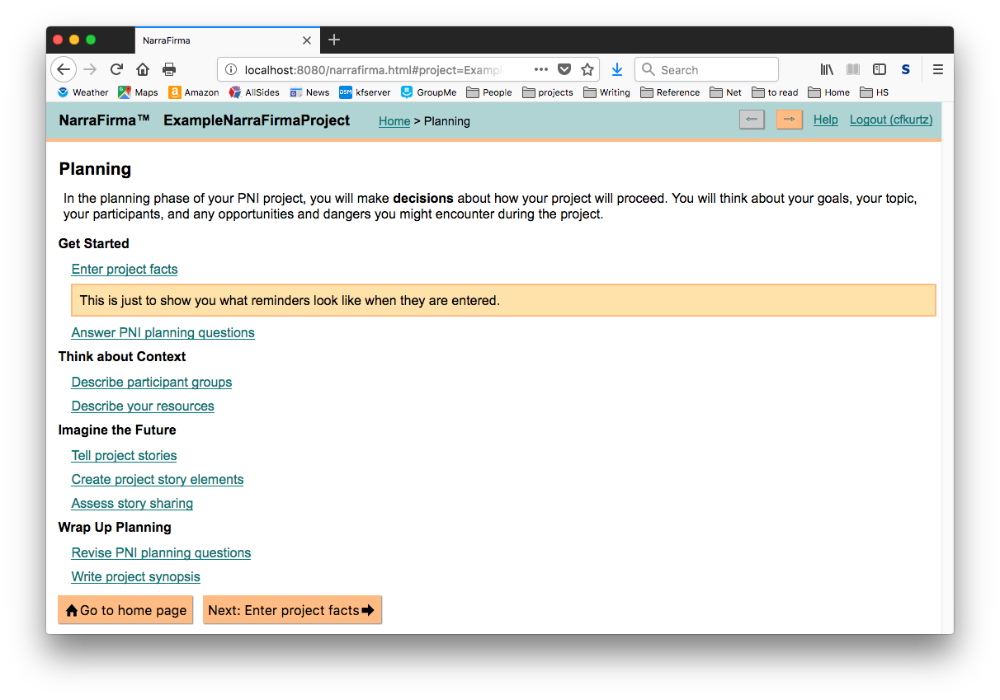
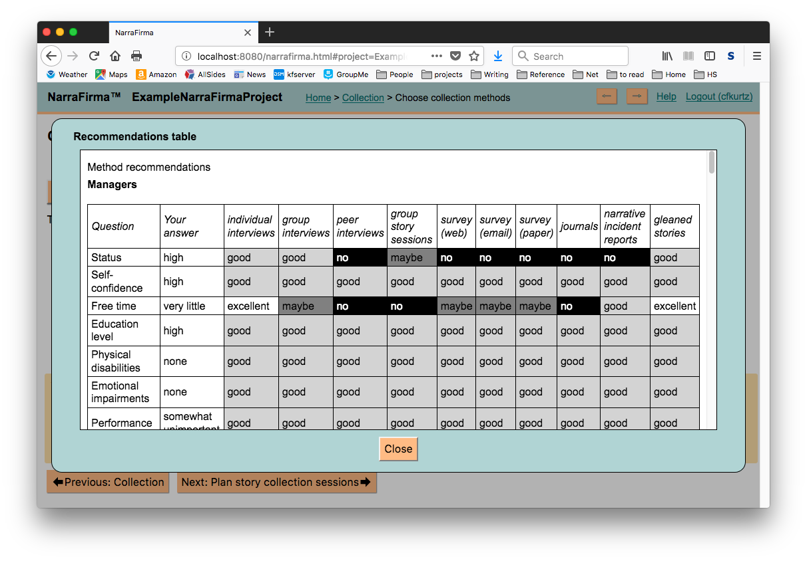
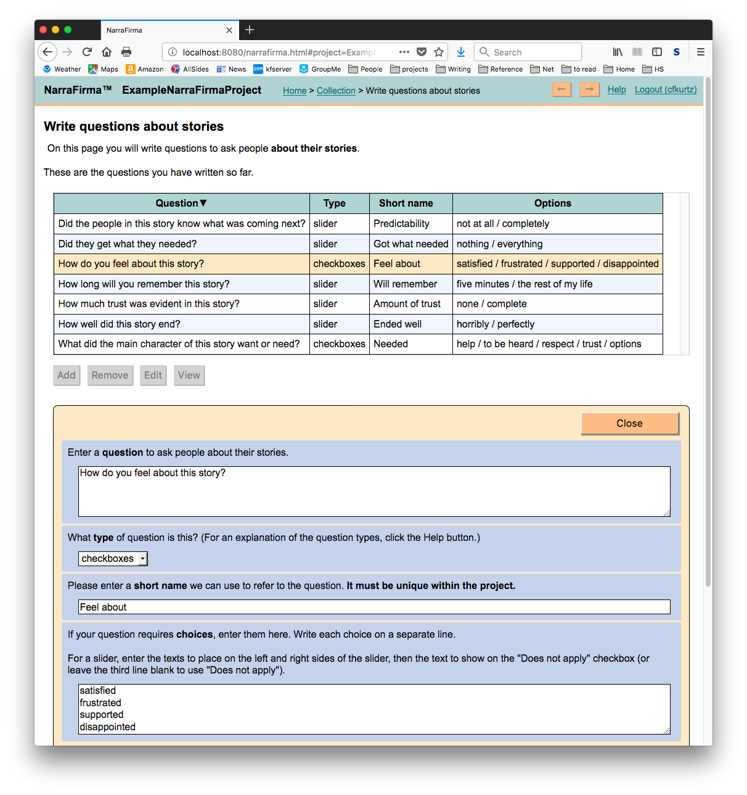
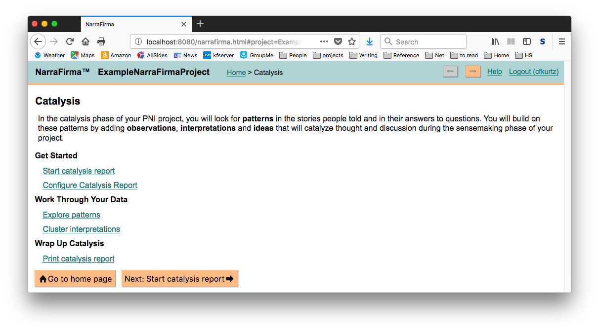
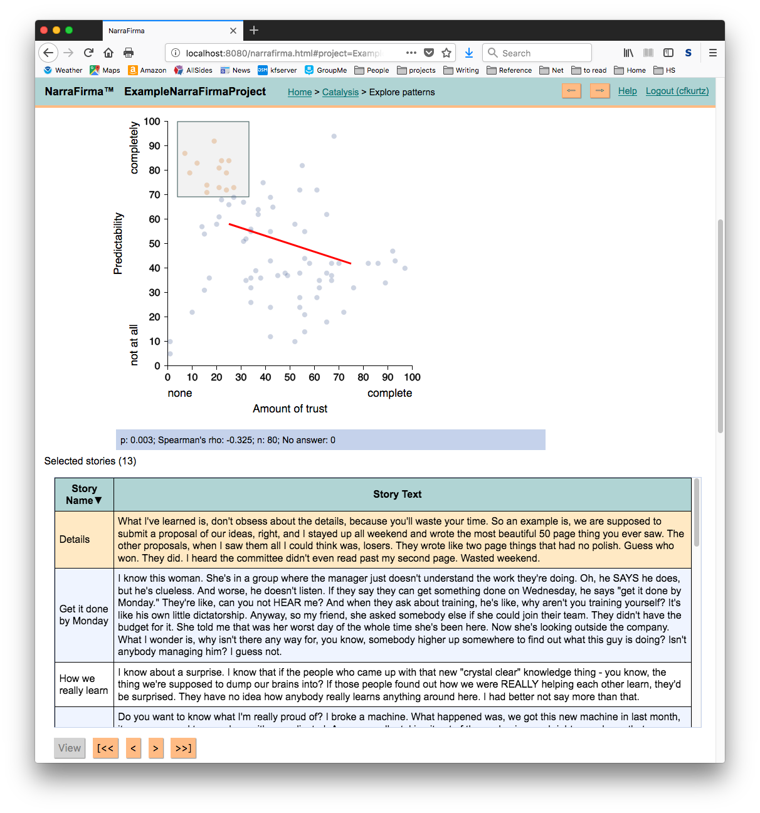
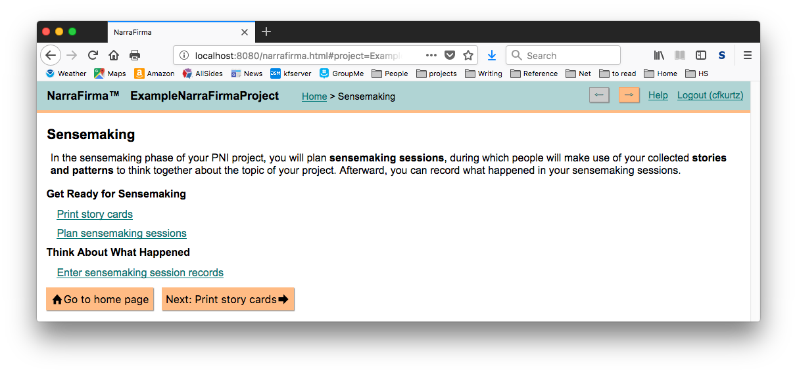
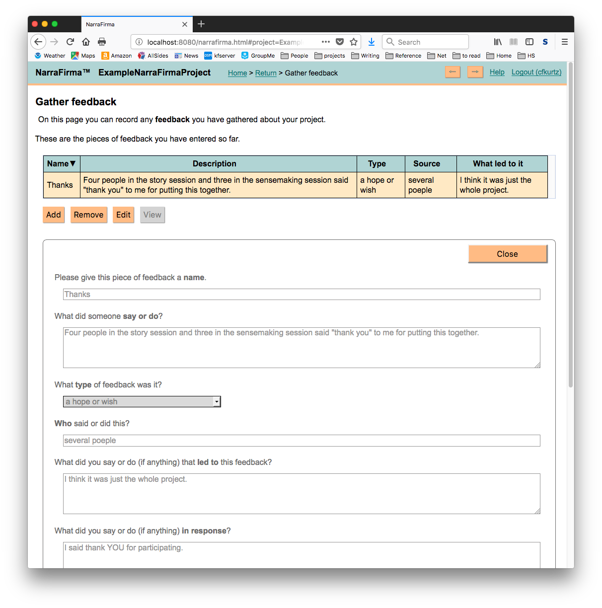

# NarraFirma Screenshots

These screenshots give you an idea of what using the NarraFirma application is like. To try out a NarraFirma installation yourself,
visit [the NarraFirma web site](https://www.narrafirma.com) and click "Try it". To learn more about
the ideas behind NarraFirma, visit the web site of its companion book, 
_[Working with Stories](http://www.workingwithstories.org)_.

These screenshots are current as of 2017-12-07.

## Survey

NarraFirma supports project work in [Participatory Narrative Inquiry](http://www.workingwithstories.org).
The software is mostly oriented toward users who are running PNI projects, but participants in a
story project (the people who tell the stories) may interact with NarraFirma through an online
survey. This is what they see. 

**Survey (top)**

**Survey (scrolled down)**

* * *

## NarraFirma Application

This is the home page of the NarraFirma application. The diagram shows the six phases of participatory
narrative inquiry and the six parts of the software.

**Home page**

* * *

### Planning

In the planning phase of PNI, you think about your project's goals and context, and you make decisions about how you will carry it out.

**Planning - Dashboard**

Each phase of PNI has a "dashboard" page where you can review your progress
through "reminders" you write to keep track of what you need to do next.

 **Planning - Enter project facts**

 Here you enter some basic details about your project that you want to remember.

**Planning - Describe participant groups**

Here you think through the groups of people you will be asking to tell stories. Sometimes there will be only
one group, but often you will be approaching different groups with different characteristics and needs.

* * *

### Collection

In the collection phase of PNI, as you might expect, you collect stories. 

**Collection - Dashboard**

This is the collection phase dashboard, showing all the possible parts of story collection.

There are many ways to collect stories: singly, in pairs, in groups; in person, on the phone, over the web; in speech, in writing. NarraFirma helps 
you decide with recommendations based on your descriptions of participant groups.

**Collection - Write questions about stories**

In participatory narrative inquiry, we ask people questions about the experiences they tell us about. This gives us 
a deeper understanding of the experiences, because the people themselves interpret the stories they tell. 
In this screenshot the user is reviewing questions they have written to ask people about their stories.
(There are also questions about the participants themselves.)

**Collection - Write annotation questions**

In this screenshot the user is adding extra questions - those not asked of the participants - to be
answered by a researcher. These are typically the kinds of things that would be called "coding" in qualitative or narrative
analysis, like tone of voice, word choices, whether certain things were mentioned in the story, and so on.

**Collection - Review incoming stories**

Here the user is looking at the stories they have collected. In this view you can filter the stories by
answers to questions. Here the user is looking only at stories told by people younger than 35 who said
the person in their story needed "to be heard".

**Collection - Edit stories**

Here the user is (carefully) editing a collected story. This is so you can 
anonymize stories in place (for example, removing mentions of people's names) and answer annotation questions
(shown in a different color).

* * *

### Catalysis

Catalysis is an optional phase of PNI in which people (sometimes in groups, sometimes alone) look for patterns
in the stories and answers to questions. We call this phase catalysis because it exists to catalyze thought and discussion.
NarraFirma streamlines the catalysis process so you can move quickly on to the sensemaking phase of your projects.

**Catalysis - Dashboard**

This is the catalysis phase dashboard.

 **Catalysis - Configuration**
 Here the user is making lots of choices that determine how graphs display on the page that comes next.

 **Catalysis - Explore Patterns - Significance**

 NarraFirma generates all the patterns (graphs) it can (limited by the questions and data types
 you want to consider). You can then sort your list of patterns by statistical significance,
 so you can see at a glance the strongest trends in your data.

 **Catalysis - Explore Patterns - Graph**

 Here the user has selected a pattern, is looking at the associated graph, and has selected
 a portion of the items on the graph (which are stories). They can see the list of stories selected
 below the graph.

 **Explore Patterns - Observation and Interpretations**

The crux of catalysis in PNI (and the reason it is not analysis) is that for each **observation**
made about a graph (that is, something anyone can see), we write _multiple_ **interpretations**. 
That is, instead of saying "we can see this, and it obviously means this,"
we say "we can see this, and it could mean this, or if you look at it another way, it could mean this other thing."
This practice of _deliberate disagreement_ creates a richer set of materials
to support thought and discussion in the sensemaking phase.

 **Catalysis - Cluster Interpretations**

 At this point in the catalysis process, the user (and remember, this could be a person running a project,
 a group of people running a project, or a whole bunch of people in a workshop) has entered lots of
 interpretations about lots of observations. Now they cluster those interpretations to produce
 a smaller number of **perspectives**.

 **Catalysis - Report**

 This is a catalysis report, which is typically used during a sensemaking session
 to spur discussion and thought in a group. It is generated by NarraFirma from the clustered
 interpretations, observations, and graphs in the previous pages.

* * *

### Sensemaking

The sensemaking phase of PNI typically takes place in a workshop setting with a group of people, who
make sense of the stories and other data together. They may work with a catalysis report, but they _always_ work with the stories.
A sensemaking session may be long and complex, with several structured exercises, or it can be a simpler discussion
of the stories and patterns.

**Sensemaking - Dashboard**

This is the sensemaking dashboard page.

 **Sensemaking - Plan sensemaking session**

 Here the user is planning a sensemaking session. (Not shown is the screen where the user records what went on at the session afterward.)

 **Sensemaking - Copy activity from template**

 NarraFirma includes a list of templates you can copy (based on exercises developed as part of PNI)
 and plan into your sensemaking session. (There are similar templates for story collection sessions,
 questions about stories, and questions about participants.) 

* * *

### Intervention

The intervention phase of PNI is about _changing the stories people tell_. NarraFirma follows the ideas
for narrative interventions described in [Working with Stories](http://www.workingwithstories.org).
Some examples are:

 * Setting up a story sharing space
 * Creating a narrative suggestion box
 * Building a narrative learning resource
 * Holding a participatory theatre event
 * Supporting narrative mentorship

**Intervention - Dashboard**

This is the intervention dashboard.

 **Intervention - Answer questions about project outcomes**

 Here the user is describing how the project played out for each of their participant groups. This will help
 NarraFirma suggest interventions that might be helpful to that group. (Not shown are screens where
 you can plan interventions and record what happened when you carried them out.)

* * *

### Return

The return phase of PNI is all about follow-through. In the return phase the stories return to the community (whether
or not you are paying attention) and people process the event of the project.

**Return - Dashboard**

This is the return phase dashboard.

**Return - Gather feedback**

On this screen you can record feedback you got from people about the project, both to help them process
what happened and to help you learn from it.

 **Return - Reflect on the project**

 On this screen there is a place to reflect in general on the entire project
 and save your reflections so you can learn from them years later, when you have forgotten
 the details of what you worked on.

